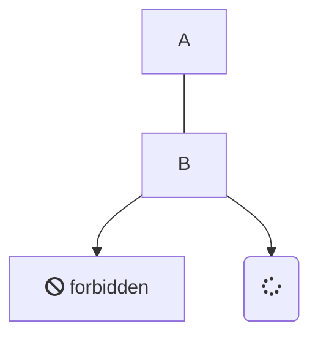

# Headline
Is this thing on??
should not have a number

should also not have a number

> An awesome project.

## This is test


```html
<div id="myDiv"></div>
<script>
    var data = [{
        x:  [1, 2, 3],
        y:  [2, 1, 3],
        type:  'bar'
    }];
    Plotly.newPlot('myDiv', data);
</script>
```
```js
function greet() {
  console.log('Hello, World!!');
}
```


### Mermaid




```python
 1  import arcpy, os, time, uuid, sys
 2  from zipfile import ZipFile
 3  import datetime
 4  
 5  from arcgis.gis import GIS
 6  import arcgis.features
 7  
 8  from auth import portalLogon
 9  
10  from general_py_functions import query_features
11  from general_py_functions import select_SQL
12  
13  
14  class CustomException(Exception):
15      def __init__(self, message):
16      # Call the base class constructor with the custom message
17      super().__init__(message)


def notify_by_email(message):
    from email.message import EmailMessage
    import smtplib

    sender = 'tphillips@flaglercounty.gov'
    recipients = ['wwhitley@flaglercounty.gov'] #, 'tphillips@flaglercounty.gov']

    email = EmailMessage()

    email["From"] = sender
    email["To"] = recipients
    email["Subject"] = "FAILURE message from script server"
    email.set_content(message)

    smtp = smtplib.SMTP("flaglercounty-gov.mail.protection.outlook.com")
    smtp.starttls()
    try:
        smtp.sendmail(sender, recipients, email.as_string())
    except:
        print('using 3.11.x version of command, as in examples provided https://docs.python.org/3/library/email.examples.html')
        smtp.send_message(sender, recipients, email.as_string())
    smtp.quit()

# (zip function)
def zipDir(dirPath, zipPath):
    '''Zip File Geodatabase'''
    zipf = ZipFile(zipPath , mode='w')
    gdb = os.path.basename(dirPath)
    for root, _ , files in os.walk(dirPath):
        for file in files:
            if 'lock' not in file:
               filePath = os.path.join(root, file)
               zipf.write(filePath , os.path.join(gdb, file))
    zipf.close()

def datetimeString():
    return f'{datetime.date.today().strftime("%m/%d/%Y")}, {datetime.datetime.now().strftime("%H:%M:%S")}'

try:
    print('...starting...')
    
    # To allow overwriting the outputs change the overwrite option to true.
    arcpy.env.overwriteOutput = True

    gis = portalLogon() #default login to AGO (via auth.py)
    #gis = portalLogon(source_script=path.basename(path.realpath(__file__)))
    print('portal logon...')

    # create uniquely name for temp gdb
    gdbId = str(uuid.uuid4())
    print(gdbId)

    # use scratchFolder for temp gdb
    gdb = arcpy.CreateFileGDB_management(arcpy.env.scratchFolder, gdbId)[0]
    print('gdb created, see: {}'.format(os.path.join(arcpy.env.scratchFolder, gdbId)))

    #DELETE CONFIDENTIAL ADDRESSES FROM FEATURE

    #database connection
    arcpy.env.workspace = ws = r'C:\Users\GIS\Desktop\Python Scripts\Master [agsreader].sde\gisdata10.DBO.E911'
    print('workspace set')

    # Local data, source SDE address points:
    AddressPoints = os.path.join(ws, 'gisdata10.DBO.AddressPoints')
    print('AddressPoints path set and is valid?: {}'.format(arcpy.Exists(AddressPoints)))
    print('next step copies to temp gdb, path is: {}'.format(os.path.join(gdb, 'AddressPointsPublic')))

    # Copy Features to temp gdb scratch workspace
    AddressPointsPublic = arcpy.CopyFeatures_management(in_features=AddressPoints, out_feature_class=os.path.join(gdb, 'AddressPointsPublic'))[0]
    print('AddressPointsPublic created, see: {}'.format(AddressPointsPublic))
    

    #delete sensitive fields
    drop_fields = ["ADD_TYPE","NOTES","ALT_ADDR","AKA_1","C1_EXCEP","CONF"]
    arcpy.DeleteField_management(AddressPointsPublic,drop_fields)
    print('fields deleted')

    #revision 09/28, trying arcpy Append for better reliability
    #    no need for zip and no need for adding zipped content
    
    # making use of zip function - zipping to prepare for AGOL upload, i.e., without loading values from drop_fields
    #zipDir(gdb, gdb + ".zip")

    #fgd_properties={'title':gdbId, 'tags':'temp file geodatabase', 'type':'File Geodatabase'}

    # adding the zipped gdb as temp item to AGO
    #fgd_item = gis.content.add(item_properties=fgd_properties, data=gdb + ".zip")
    #print('fgd_item added')


    # getting feature layer in service to truncate/append
    fsItemId = 'b16c7525cc74422facf7d3345b699885'
    serviceLayer = gis.content.get(fsItemId)
    print(serviceLayer)
    fLyr = serviceLayer.layers[0]   #1st and only layer in this service
    print('ready to proceed with process, delete_features')

    # added section to avoid error in case table is already empty (if hiccups on a run, stopping after table emptied, failure is imminent on next run)
    if query_features(fLyr.url, count=True) != 0:
        try:
            # truncate if fLyr settings support this operation, otherwise use delete_features
            fLyr.manager.truncate()
            print('truncated table successfully')
        except:
            # this feature layer has views, so truncating not an option - deleting feature in chunks instead
            objectIdField = fLyr.manager.properties.objectIdField

            minOID = fLyr.query(out_statistics=[{"statisticType": "MIN", "onStatisticField": objectIdField, "outStatisticFieldName": "MINOID"}])
            minOBJECTID = minOID.features[0].attributes['MINOID']

            maxOID = fLyr.query(out_statistics=[{"statisticType": "MAX", "onStatisticField": objectIdField, "outStatisticFieldName": "MAXOID"}])
            maxOBJECTID = maxOID.features[0].attributes['MAXOID']

            x = minOBJECTID
            y = x + 1999        #provided 2000 limit set by service

            while x < maxOBJECTID:
                query = f"{objectIdField} >= {x} AND {objectIdField} <= {y}"
                fLyr.delete_features(where=query)
                x += 2000
                y += 2000

            print('finished process, delete_features')
    print('should be 0:  {}'.format(0 == query_features(fLyr.url, count=True)))

    #revised 10/12/2024 - ready to try different means to upload...
##    print('exiting...')
##    sys.exit()

    # likewise should append when table completely empty:
    if query_features(fLyr.url, count=True) == 0:
        # appending to feature layer from temp loaded zipped gdb
        #fLyr.append(item_id=fgd_item.id, upload_format="filegdb", upsert=False, field_mappings=[])

        #revision 09/28, trying arcpy Append for better reliability
        arcpy.management.Append(AddressPointsPublic, fLyr.url, "NO_TEST") # fgd_item.id

        # update item updated date
        date_text = '{} Updated {}'.format(serviceLayer.snippet.rsplit(' ', 3)[0], datetimeString())
        serviceLayer.update(item_properties={'snippet': date_text})

        print("Successfully Uploaded service....final feature count comparison check underway...")
        #notify_by_email("successfully uploaded service - {}".format(os.path.realpath(__file__)))
    else:
        raise CustomException('append rows prevented after table could not be emptied')

    # note that the append process itself could be faulty, so best to check and compare final feature counts
    if query_features(fLyr.url, count=True) != select_SQL('gisdata10.DBO.AddressPoints', os.path.dirname(ws)):
        raise CustomException('append rows count does not match original feature count')
    else:
        print("Final feature count check passed...end of successful script run.")
    
except CustomException as e:
    fLyr_count = query_features(fLyr.url, count=True)
    sde_count = select_SQL('gisdata10.DBO.AddressPoints', os.path.dirname(ws))
    fgdb_count = arcpy.management.GetCount(AddressPointsPublic)
    count_string = "{}, {}, {}".format(fLyr_count, sde_count, fgdb_count)
    notify_by_email("...error from arcpy on script server (from script file):\n{}\n{}\n\n{}\ncounts: {}".format(os.path.realpath(__file__), "Layer loading error:", e, count_string))
except:
    notify_by_email("...error from arcpy on script server (from script file:\n{}\n\n{}".format(os.path.realpath(__file__), arcpy.GetMessages()))

finally:
    #revision 09/28, trying arcpy Append for better reliability; no need for finally clause
    
    # clean up scratch workspace and remove uploaded zipped fgdb
    #fgd_item.delete()
    arcpy.Delete_management(gdb)
    print('temp gdb deleted')
##    os.remove(gdb + ".zip")

```

x

x

x

x

x

x

x
x
x
# some other header

# My Docsify Page

This is a paragraph of text.

<div id="myDiv2"></div>
<div id="my-element">
  This element will be modified by JavaScript.
</div>
<div id="my-element2">
  ...or this element will be modified by JavaScript.
</div>
<div id="my-element30">
  ...modified by JavaScript?
</div>

<script>
    const element2 = document.getElementById("myDiv2");
d3.csv('https://raw.githubusercontent.com/plotly/datasets/master/api_docs/mt_bruno_elevation.csv', function(err, rows){
function unpack(rows, key) {
  return rows.map(function(row) { return row[key]; });
}
var z_data=[ ]
for(i=0;i<24;i++)
{
  z_data.push(unpack(rows,i));
}

var data = [{
  z: z_data,
  type: 'surface',
  contours: {
    z: {
      show:true,
      usecolormap: true,
      highlightcolor:"#42f462",
      project:{z: true}
    }
  }
}];

var layout = {
  title: {
    text: 'Mt Bruno Elevation With Projected Contours'
  },
  scene: {camera: {eye: {x: 1.87, y: 0.88, z: -0.64}}},
  autosize: false,
  width: 500,
  height: 500,
  margin: {
    l: 65,
    r: 50,
    b: 65,
    t: 90,
  }
};

Plotly.newPlot(element2, data, layout);
});

  const element = document.getElementById("my-element");
  element.textContent = "Modified by JavaScript!";

</script>
